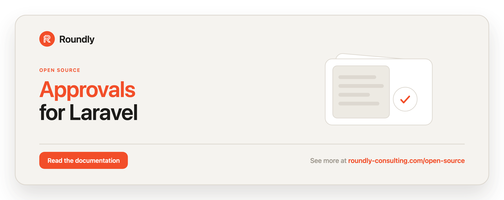

<!-- roundly-hero:start -->
<p align="center">
  <a href="https://roundly-consulting.com/open-source/docs/approvals-for-laravel?utm_source=github&utm_medium=readme&utm_campaign=open-source&utm_content=approvals-for-laravel">
    
  </a>
</p>
<!-- roundly-hero:end -->

<!-- roundly-badges:start -->
<p align="center">
  <a href="https://packagist.org/packages/roundly-consulting/approvals-for-laravel"></a>
  <a href="https://github.com/roundly-consulting/approvals-for-laravel/actions/workflows/run-tests.yml"></a>
  <a href="https://github.com/roundly-consulting/approvals-for-laravel/actions/workflows/fix-php-code-style-issues.yml"></a>
  <a href="https://donate.stripe.com/dRmeVe8FX5PF1Qd9pXcEw00"></a>
  <a href="https://www.patreon.com/cw/roundly"></a>
  <a href="https://roundly-consulting.com/support-us?utm_source=github&utm_medium=readme&utm_campaign=open-source&utm_content=approvals-for-laravel#crypto"></a>
</p>
<!-- roundly-badges:end -->

# Approvals for Laravel

Model approvals, rejections, and multi-approver sign-off between Eloquent models.

Any model can act as an **actor** that decides on things (a user, a team, a service account),
and any model can be **approvable** (a deployment, a document, a comment). Decisions carry an
explicit status (`pending`, `approved`, `rejected`, `cancelled`, `expired`), an optional reason,
and an optional expiry. A subject can also open an **approval request** that needs sign-off from
several approvers under a rule (unanimous, quorum, any-one, or **weighted**), resolving
automatically as decisions come in. Requests can run as **sequential, staged pipelines**,
approvers can **delegate** their authority for a time window, and common setups can be
captured as named **workflow presets**. Every transition fires an event you can hook into,
including a single umbrella `ApprovalStatusChanged` event.

The original lightweight "toggle" workflow still works as a one-liner.

## Requirements

- PHP 8.4
- Laravel 12 or 13

## Installation

```bash
composer require roundly-consulting/approvals-for-laravel
```

Publish and run the migrations:

```bash
php artisan vendor:publish --tag="approvals-migrations"
php artisan migrate
```

The migrations are **not** loaded automatically — publishing them is required. The six files
land in your `database/migrations` with timestamps that preserve their order, so `migrate`
creates the four tables and applies the two schema additions in the order they depend on.

Optionally publish the config file:

```bash
php artisan vendor:publish --tag="approvals-config"
```

## Configuration

The published `config/approvals.php`:

```php
return [
    'model' => RoundlyConsulting\Approvals\Models\Approval::class,
    'request_model' => RoundlyConsulting\Approvals\Models\ApprovalRequest::class,
    'stage_model' => RoundlyConsulting\Approvals\Models\ApprovalRequestStage::class,
    'delegation_model' => RoundlyConsulting\Approvals\Models\ApprovalDelegation::class,
    'default_status' => RoundlyConsulting\Approvals\Enums\ApprovalStatus::Approved->value,
    'authorization' => [
        'enabled' => env('APPROVALS_AUTHORIZATION', false),
        'ability' => 'decide-approval',
    ],
    'expiry' => [
        'default' => null,
    ],
    'workflows' => [
        // see "Workflow presets" below
    ],
];
```

| Key | Type | Default | Purpose |
|---|---|---|---|
| `model` | `class-string<Approval>` | `Approval::class` | Model used to persist decisions. Must extend the package's `Approval`. |
| `request_model` | `class-string<ApprovalRequest>` | `ApprovalRequest::class` | Model used to persist multi-approver requests. Must extend the package's `ApprovalRequest`. |
| `stage_model` | `class-string<ApprovalRequestStage>` | `ApprovalRequestStage::class` | Model used to persist a staged request's stages. Must extend the package's `ApprovalRequestStage`. |
| `delegation_model` | `class-string<ApprovalDelegation>` | `ApprovalDelegation::class` | Model used to persist delegations. Must extend the package's `ApprovalDelegation`. |
| `default_status` | `string` | `'approved'` | Status applied to a toggled approval (`approved` by default). |
| `authorization.enabled` | `bool` | `false` (env `APPROVALS_AUTHORIZATION`) | When true, every decision is gated through a Gate ability. |
| `authorization.ability` | `string` | `'decide-approval'` | The Gate ability checked against the approvable. |
| `expiry.default` | `int\|null` | `null` | Default approval lifetime in seconds. `null` means never. |
| `workflows` | `array` | `[]` | Named workflow presets (see below). |

The package runs with zero host configuration.

## Usage

Everything goes through one API — the `Approvals` facade, the injectable
`ApprovalsManager` behind it, or the action classes it runs. All three execute the same code.

### The facade

```php
use RoundlyConsulting\Approvals\Facades\Approvals;

// One actor's decision on one approvable
Approvals::for($deployment)->as($user)->because('Looks good to me')->approve();
Approvals::for($deployment)->as($user)->because('Please add tests')->reject();
Approvals::for($deployment)->as($user)->ask();                 // record a pending decision
Approvals::for($deployment)->as($user)->cancel();              // withdraw an active decision
Approvals::for($deployment)->as($user)->toggle();              // simple on/off
Approvals::for($deployment)->as($user)->expiresIn(86400)->approve();
Approvals::for($deployment)->as($user)->weight(3)->approve();  // override the decision's weight
Approvals::for($invoice)->as($user)->within($request)->approve(); // pin to one request

// Reads
Approvals::for($deployment)->as($user)->isApproved();  // bool
Approvals::for($deployment)->as($user)->isRejected();  // bool
Approvals::for($deployment)->hasPending();             // bool — any pending decision

// Multi-approver requests (flat, staged, or from a workflow preset)
Approvals::request($invoice)->from([$a, $b, $c])->quorum(2)->expiresIn(3600)->open();
Approvals::request($release)->stages([...])->continueOnRejection()->expiringAt($t)->open();
Approvals::request($budget)->workflow('payout')->open([$a, $b, $c]);

Approvals::status($invoice);        // ApprovalStatus of the latest request (Pending when none)
Approvals::progress($invoice);      // ?ApprovalProgress
Approvals::currentStage($release);  // ?ApprovalRequestStage
Approvals::preset('payout');        // WorkflowPreset from config

// Delegation
Approvals::delegations($boss)->to($deputy)->from($monday)->until($friday)->grant();
Approvals::delegations($boss)->revoke($deputy);   // or ->revoke() for all; returns int
Approvals::delegations($boss)->active();          // Collection<ApprovalDelegation>
Approvals::delegationFor($deputy);                // ?ApprovalDelegation in force now

// Housekeeping
Approvals::expire();                // lapse due pending decisions; returns int
```

| Method | Returns | Notes |
|---|---|---|
| `for($approvable)` / `as($actor)` | `PendingApproval` | set the other side with `as()` / `for()` |
| `->within(ApprovalRequest)` | `PendingApproval` | the request must belong to the approvable, or `InvalidApprovalRequestException` |
| `->because(?string)`, `->weight(int)`, `->expiresIn(int)`, `->expiringAt($t)` | `PendingApproval` | |
| `->approve()` / `->reject()` / `->ask()` | `Approval` | |
| `->cancel()` | `?Approval` | `null` when there was nothing to withdraw |
| `->toggle()` | `bool` | `true` created, `false` removed |
| `->isApproved()` / `->isRejected()` / `->hasPending()` | `bool` | |
| `request($subject)` | `PendingApprovalRequest` | |
| `->from([...])`, `->rule(ApprovalRule, ?quorum)`, `->any()`, `->quorum(n)`, `->weighted(n)` | `PendingApprovalRequest` | flat request |
| `->stages([StageDefinition, ...])`, `->continueOnRejection()` | `PendingApprovalRequest` | staged request; `from()` and `stages()` together throw |
| `->expiresIn(int)` / `->expiringAt($t)` | `PendingApprovalRequest` | |
| `->open()` | `ApprovalRequest` | |
| `->workflow($name)->open([...])` | `ApprovalRequest` | flat list, or one list per stage |
| `status()` / `progress()` / `currentStage()` / `preset()` | see above | reads |
| `delegations($delegator)` | `DelegationsHandle` | `to()`, `revoke(?$delegate)`, `active(?$at)` |
| `->to($delegate)->from($t)->until($t)` or `->for($seconds)` | `PendingDelegation` | nothing is written until `grant()` |
| `->grant()` | `ApprovalDelegation` | validates the window, then fires `ApprovalDelegated` |
| `delegationFor($delegate, ?$at)` | `?ApprovalDelegation` | |
| `expire(?$now)` | `int` | |

The `Approvals` facade is registered automatically; a global `approvals()` helper returns the
same manager.

### Without the facade

Inject the manager — the same API, no facade:

```php
use RoundlyConsulting\Approvals\ApprovalsManager;

final class ApproveInvoice
{
    public function __construct(private ApprovalsManager $approvals) {}

    public function __invoke(Invoice $invoice, User $user): void
    {
        $this->approvals->for($invoice)->as($user)->approve();
    }
}
```

Or call an action directly:

```php
use RoundlyConsulting\Approvals\Actions\ApproveAction;
use RoundlyConsulting\Approvals\Actions\OpenApprovalRequestAction;
use RoundlyConsulting\Approvals\DataTransferObjects\ApprovalRequestData;
use RoundlyConsulting\Approvals\DataTransferObjects\DecisionData;
use RoundlyConsulting\Approvals\Enums\ApprovalRule;

app(OpenApprovalRequestAction::class)->execute(
    new ApprovalRequestData($invoice, [$a, $b, $c], ApprovalRule::Quorum, quorum: 2),
);

app(ApproveAction::class)->execute($user, $invoice, DecisionData::approved('LGTM'));
```

| Action | Facade path |
|---|---|
| `ApproveAction` | `for()->as()->approve()` |
| `RejectAction` | `for()->as()->reject()` |
| `RequestApprovalAction` | `for()->as()->ask()` |
| `CancelApprovalAction` | `for()->as()->cancel()` |
| `ToggleApprovalAction` | `for()->as()->toggle()` |
| `OpenApprovalRequestAction` | `request()->from()->open()` |
| `RequestStagedApprovalAction` | `request()->stages()->open()` |
| `OpenWorkflowRequestAction` | `request()->workflow()->open()` |
| `DelegateApprovalsAction` | `delegations()->to()->grant()` |
| `RevokeApprovalDelegationAction` | `delegations()->revoke()` |
| `ExpireApprovalsAction` | `expire()` |

### Faking in your tests

`Approvals::fake()` swaps in `ApprovalsFake`, a subtype of `ApprovalsManager`, for the facade
**and** for injected managers. Operations still run against your database; the fake records
each one — whether it came through the facade, an injected manager or a model trait
(`$user->approve($post)`) — so you can assert on it:

```php
use RoundlyConsulting\Approvals\Facades\Approvals;

$fake = Approvals::fake();

$this->post("/invoices/{$invoice->id}/approve");

$fake->assertApproved($invoice, by: $user);   // or Approvals::assertApproved(...)
$fake->assertNothingRejected();
```

| Assert | Negative |
|---|---|
| `assertApproved($approvable, ?$by)` | `assertNothingApproved()` |
| `assertRejected($approvable, ?$by)` | `assertNothingRejected()` |
| `assertAsked($approvable, ?$actor)` | `assertNothingAsked()` |
| `assertCancelled($approvable, ?$by)` | `assertNothingCancelled()` |
| `assertToggled($approvable, ?$by)` | `assertNothingToggled()` |
| `assertOpened($subject, ?$workflow)` | `assertNothingOpened()` |
| `assertDelegated($delegator, ?$to)` | `assertNothingDelegated()` |
| `assertRevoked($delegator, ?$delegate)` | `assertNothingRevoked()` |
| `assertExpired(?$count)` — a sweep ran (and lapsed `$count` in total) | `assertNothingExpired()` — no decision lapsed |

`$fake->recorded(?ApprovalOperation $operation)` returns the raw
`RecordedApprovalOperation` list (operation, context models, result) for custom assertions. An
operation that throws is not recorded.

### Models

Add `GivesApprovals` to the model that decides, and `HasApprovals` to the model that is decided
on. Add `RequiresApproval` to a subject that needs multi-approver sign-off. The traits are
sugar: every state change they make goes through `ApprovalsManager`, so the fake sees it.

```php
use Illuminate\Database\Eloquent\Model;
use RoundlyConsulting\Approvals\Traits\GivesApprovals;
use RoundlyConsulting\Approvals\Traits\HasApprovals;
use RoundlyConsulting\Approvals\Traits\RequiresApproval;

class User extends Model
{
    use GivesApprovals;
}

class Deployment extends Model
{
    use HasApprovals;
}

class Release extends Model
{
    use HasApprovals;
    use RequiresApproval;
}
```

### Trait sugar

```php
$user->approve($deployment, 'LGTM');     // Approval
$user->reject($deployment, 'needs work'); // Approval
$user->cancelApproval($deployment);       // ?Approval
$user->toggleApproval($deployment);       // bool (simple on/off)

$user->hasApproved($deployment);          // bool — holds an approved decision
$user->hasRejected($deployment);          // bool
$user->approvalFor($deployment);          // ?Approval (latest)

$deployment->hasBeenApprovedBy($user);    // bool
$deployment->hasBeenRejectedBy($user);    // bool
$deployment->isApprovedBy($user);         // bool
$deployment->approvalCount();             // int
$deployment->pendingApprovals();          // Collection<Approval>
```

### Multi-approver requests & quorum

```php
use RoundlyConsulting\Approvals\Enums\ApprovalRule;

// Unanimous: every approver must approve; one rejection rejects the request.
$release->requestApproval([$lead, $qa, $pm], ApprovalRule::Unanimous);

// Quorum: 2 of 3 approvals resolve it; it rejects once 2 approvals are no longer reachable.
$release->requestApproval([$lead, $qa, $pm], ApprovalRule::Quorum, quorum: 2);

// Any: the first approval resolves it.
$release->requestApproval([$lead, $qa, $pm], ApprovalRule::Any);

$lead->approve($release);   // decisions flow into the open request automatically
$qa->approve($release);

$release->isApproved();              // bool
$release->isPendingApproval();       // bool
$release->currentApprovalStatus();   // ApprovalStatus
```

### Weighted thresholds

`ApprovalRule::Weighted` (and `Quorum`) resolve on the **summed weight** of approvals rather
than a headcount. The `quorum` value is the weight threshold. Plain quorum keeps working
unchanged because every decision defaults to weight `1`.

Give an actor a weight by implementing `ProvidesApprovalWeight`:

```php
use RoundlyConsulting\Approvals\Interfaces\ProvidesApprovalWeight;

class User extends Model implements ProvidesApprovalWeight
{
    use GivesApprovals;

    public function approvalWeight(?Model $approvable = null): int
    {
        return $this->is_director ? 3 : 1;
    }
}

$release->requestApproval([$director, $analyst], ApprovalRule::Weighted, quorum: 3);
$director->approve($release);   // weight 3 alone meets the threshold -> approved
```

You can also override the weight per decision:
`Approvals::for($release)->as($analyst)->weight(2)->approve()`.

### Sequential / staged pipelines

A request can run as an ordered set of stages. Stage *N* only opens once stage *N-1* has
cleared; by default a rejection in any stage rejects the whole request.

```php
use RoundlyConsulting\Approvals\DataTransferObjects\StageDefinition;
use RoundlyConsulting\Approvals\Enums\ApprovalRule;

$release->requestStagedApproval([
    new StageDefinition([$eng1, $eng2], ApprovalRule::Unanimous, name: 'engineering'),
    new StageDefinition([$product],     ApprovalRule::Any,       name: 'product'),
]);

$release->currentStage();       // ?ApprovalRequestStage — the open stage
$release->approvalProgress();   // ?ApprovalProgress — counts, current/total stages, percentage()

// The same through the facade:
Approvals::request($release)->stages([...])->continueOnRejection()->expiringAt($deadline)->open();
```

Pass `rejectOnStageRejection: false` (facade: `continueOnRejection()`) to let the pipeline
continue past a rejected stage, and `expiresAt:` (facade: `expiringAt()`) to stamp an expiry.
Staged requests dispatch `ApprovalStageOpened` and `ApprovalStageCleared`.

### Delegation (proxy authority)

An approver can hand their authority to another model for a window. While the delegation is
active, the delegate's decisions count **as the delegator** — the approval records both the
delegator (as `actor`) and the delegate (as `decided_by`).

```php
use Carbon\CarbonImmutable;

Approvals::delegations($manager)->to($assistant)->until(CarbonImmutable::now()->addWeek())->grant();
// or ->from($start), ->for($seconds) (measured from the start), or no window at all

$manager->delegateApprovalsTo($assistant);                                    // open-ended
$manager->delegateApprovalsTo($assistant, until: CarbonImmutable::now()->addWeek());

$assistant->approve($release);          // counts as $manager
$approval->wasDelegated();              // true
$approval->actor;                       // $manager
$approval->decidedBy;                   // $assistant

$manager->revokeApprovalDelegation();           // revoke all
$manager->revokeApprovalDelegation($assistant); // revoke one
$manager->approvalDelegations;                  // MorphMany<ApprovalDelegation>
Approvals::delegations($manager)->active();     // the ones in force now
```

Nothing is written until `grant()`: self-delegation and a window that ends before it starts
throw `RoundlyConsulting\Approvals\Exceptions\InvalidDelegationException` and leave no row
behind. `ApprovalDelegated` fires once, with the final window; `ApprovalDelegationRevoked`
fires per revoked delegation.

### Workflow presets

Capture a reusable rule/quorum/stage/expiry setup in `config('approvals.workflows')` so call
sites stay short:

```php
'workflows' => [
    'payout' => [
        'rule' => ApprovalRule::Quorum->value,
        'quorum' => 2,
        'required_approvers' => 3,
        'expiry' => 86400,
    ],
    'release' => [
        'reject_on_stage_rejection' => true,
        'stages' => [
            ['rule' => ApprovalRule::Unanimous->value, 'required_approvers' => 2, 'name' => 'engineering'],
            ['rule' => ApprovalRule::Any->value,       'required_approvers' => 1, 'name' => 'product'],
        ],
    ],
],
```

```php
// Flat preset: a single approver list.
Approvals::request($budget)->workflow('payout')->open([$a, $b, $c]);

// Staged preset: one approver group per stage, in order.
Approvals::request($release)->workflow('release')->open([[$eng1, $eng2], [$product]]);
```

An unknown or malformed preset throws
`RoundlyConsulting\Approvals\Exceptions\UnknownWorkflowException`.

### Authorization

Set `approvals.authorization.enabled` to `true` (or `APPROVALS_AUTHORIZATION=true`) to gate every
decision through a Gate ability. The package never defines the gate — your app does:

```php
Gate::define('decide-approval', fn ($user, $approvable) => $user->can('review', $approvable));
```

A denied gate throws `RoundlyConsulting\Approvals\Exceptions\UnauthorizedApprovalException`.

### Expiry

```php
Approvals::for($budget)->as($cfo)->expiresIn(86400)->approve();

// Lapse due pending approvals (schedule this):
Approvals::expire();
```

```bash
php artisan approvals:expire
```

### Blade directives

```blade
@approved($deployment, $user) Approved by you @endapproved
@rejected($deployment, $user) You rejected this @endrejected
@pendingApproval($deployment) Awaiting a decision @endpendingApproval
```

### Events

Each transition dispatches an event carrying the relevant model:

| Event | Fired when |
|---|---|
| `ApprovalRequested` | a pending decision is recorded |
| `ApprovalApproved` | a decision is approved |
| `ApprovalRejected` | a decision is rejected |
| `ApprovalCancelled` | a decision is withdrawn |
| `ApprovalExpired` | a pending decision lapses |
| `ApprovalRequestResolved` | a request reaches approved/rejected |
| `ApprovalToggled` | `toggleApproval()` runs |
| `ApprovalStageOpened` | a staged request opens a stage |
| `ApprovalStageCleared` | a staged request clears a stage |
| `ApprovalDelegated` | an approver delegates authority |
| `ApprovalDelegationRevoked` | a delegation is revoked |
| `ApprovalStatusChanged` | **umbrella** — fired for every status change alongside the granular events |

Subscribe to `ApprovalStatusChanged` once to observe all transitions. It carries the
`subject` (approval or request), `from`/`to` `ApprovalStatus`, and the `actor`:

```php
use RoundlyConsulting\Approvals\Events\ApprovalStatusChanged;

class AuditApprovalChanges
{
    public function handle(ApprovalStatusChanged $event): void
    {
        // $event->from, $event->to, $event->subject, $event->actor
    }
}
```

```php
use RoundlyConsulting\Approvals\Events\ApprovalApproved;

class NotifyOnApproval
{
    public function handle(ApprovalApproved $event): void
    {
        // $event->approval — the Approval model
    }
}
```

### The simple toggle

```php
$user->toggleApproval($deployment); // true  — approval created (status: approved)
$user->toggleApproval($deployment); // false — approval removed (soft delete)
```

`toggleApproval()` is the one-click on/off form: it creates an approved decision or soft-deletes
it, and fires `ApprovalToggled`.

### Test helpers (for host apps)

Opt-in ergonomics for testing your own app, next to `Approvals::fake()` (see
[Faking in your tests](#faking-in-your-tests)). They live under
`RoundlyConsulting\Approvals\Testing` and pull in **no runtime dependency** — Pest is only
touched when you call the registrar.

Pest custom expectations — register once in your `tests/Pest.php`:

```php
use RoundlyConsulting\Approvals\Testing\ApprovalExpectations;

ApprovalExpectations::register();

// then in tests:
expect($release)->toBeApproved();
expect($release)->toBePendingApproval();
expect($release)->toBeRejected();
```

A test-case trait for acting as an approver:

```php
use RoundlyConsulting\Approvals\Testing\InteractsWithApprovals;

uses(InteractsWithApprovals::class);

$this->actingAsApprover($reviewer)->approveAs($release);
$this->rejectAs($release, 'needs work', $otherReviewer);
```

Both helpers go through `ApprovalsManager`, so they are recorded under `Approvals::fake()`.

Factories ship states for the new models too: `ApprovalFactory::weight()/delegated()/forStage()`,
`ApprovalRequestFactory::weighted()/staged()`, plus `ApprovalDelegationFactory` and
`ApprovalRequestStageFactory`.

## Integrates with

### [`enums-for-laravel`](https://github.com/roundly-consulting/enums-for-laravel)

Both package enums — `ApprovalStatus` and `ApprovalRule` — use the shared
`RoundlyConsulting\Enums\Helpers` trait, so they expose the full fleet helper surface on top of
their domain methods (`isPending()`/`isDecided()`/`isFinal()`/`canTransitionTo()`;
`isWeighted()`), with **no lang file to maintain**:

```php
use RoundlyConsulting\Approvals\Enums\ApprovalStatus;
use RoundlyConsulting\Approvals\Enums\ApprovalRule;

ApprovalStatus::values();          // ['pending','approved','rejected','cancelled','expired']
ApprovalStatus::labels();          // ['Pending','Approved','Rejected','Cancelled','Expired']
ApprovalStatus::options();         // list of {value, label, name} option DTOs for selects
ApprovalStatus::validationRule();  // 'in:pending,approved,rejected,cancelled,expired'
ApprovalStatus::tryFromName('Approved');   // ApprovalStatus::Approved

ApprovalStatus::Approved->readable();      // 'Approved' (translated, headline-cased)
ApprovalStatus::Approved->isIn([ApprovalStatus::Approved, ApprovalStatus::Rejected]); // true

ApprovalRule::options();           // ready-made rule picker
ApprovalRule::validationRule();    // 'in:unanimous,quorum,any,weighted'
$rule->readable();                 // 'Unanimous', 'Quorum', 'Any', 'Weighted'
```

Drop `ApprovalStatus::validationRule()` / `ApprovalRule::validationRule()` straight into host
request rules, and `::options()` into a select or JSON payload — both stay in sync with the cases
automatically.

## Testing

```bash
composer test
```

## Changelog

Please see [CHANGELOG](CHANGELOG.md) for what has changed recently.

<!-- roundly-support:start -->
## Support our work

This package is free and open source, built and maintained by
[Roundly Consulting](https://roundly-consulting.com/open-source?utm_source=github&utm_medium=readme&utm_campaign=open-source&utm_content=approvals-for-laravel).
If it saves you time, please consider supporting our open-source work — a one-time donation, a
monthly pledge on Patreon or a crypto donation helps fund maintenance, new features and new
packages.

<a href="https://donate.stripe.com/dRmeVe8FX5PF1Qd9pXcEw00"></a>
<a href="https://www.patreon.com/cw/roundly"></a>
<a href="https://roundly-consulting.com/support-us?utm_source=github&utm_medium=readme&utm_campaign=open-source&utm_content=approvals-for-laravel#crypto"></a>
<!-- roundly-support:end -->

## License

The MIT License (MIT). Please see [LICENSE](LICENSE.md) for more information.
